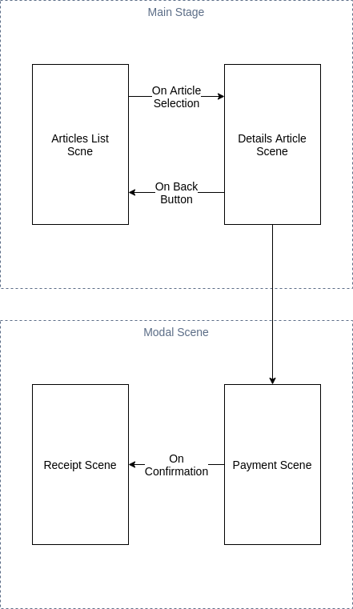

# Shoppy

Static E-commerce Application using JavaFX and SceneBuilder to list, select and buy articles.

### Prerequisites
- Java 15 
- JavaFX 11
### Project Structure
```
 ressource
        ├──icons
        ├──images 
        ├──view
        ├──styles
 src
        ├──controllers
        ├──entities
        ├──Main.java    
```

- ressources:
    - icons : contains the used icons (can be merged with image folder)
    - Images: contains the images of the listed articles
    - Views: contains the FXML files
     - styles: contains the css files
- src:
    - controllers: As its name suggest, contains the controllers of the application
    - entities: Contains the used classes in the application (Article, Extended Buttons..)
    - Main.java: The start point of the application
    
### Application Architecture 

